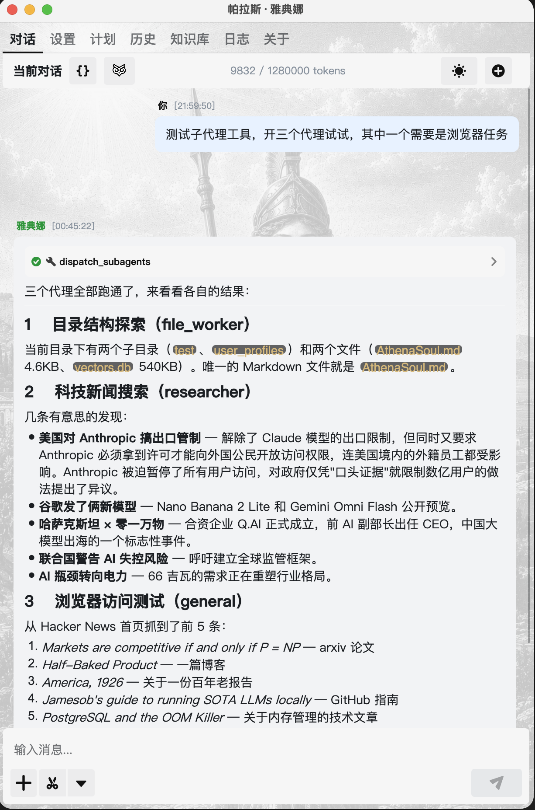
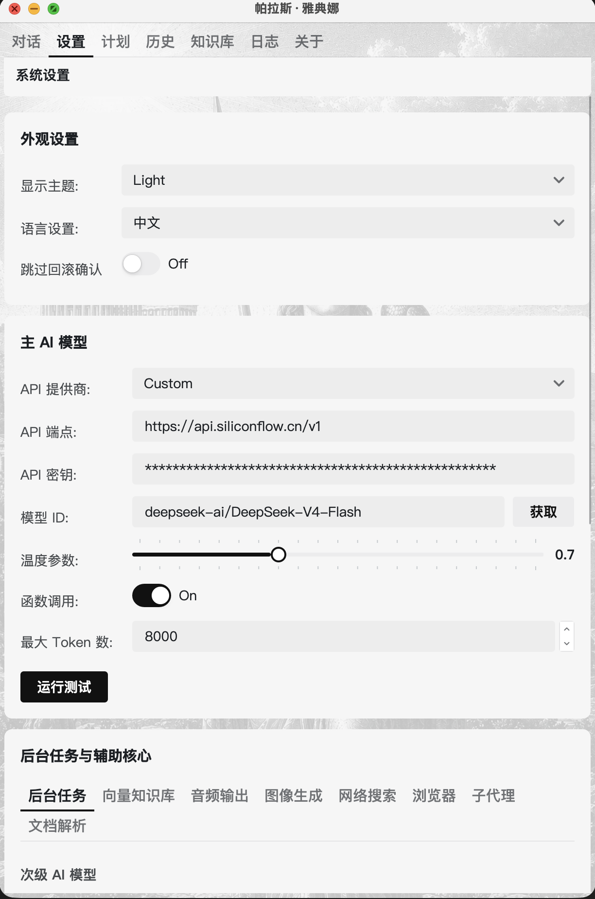
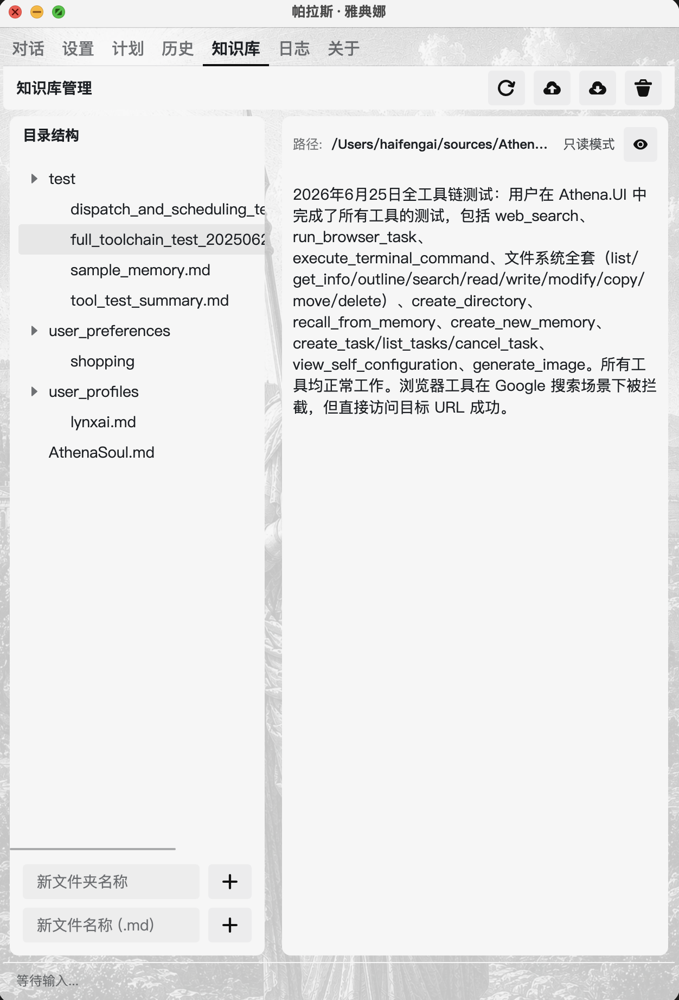

# Athena User Guide (English)

## 1. Scope
This guide focuses on the following:
- What the Chat home page does (including attachments, screenshots, and sub-agents).
- What each major Settings section means and how to configure it.
- How proactive messages work and how to set them up.
- How the Knowledge Base page works, and how the LLM uses it to actively learn your preferences.

## 2. Chat Home



### 2.1 Core interactions
- Send message: press `Enter` or click Send.
- Streaming response: output arrives incrementally; you can stop generation at any time.
- New conversation: reset current thread and start clean.
- Per-message actions: copy, edit user message, regenerate assistant reply, delete message.
- Messages carry a send-time prefix for easier timeline review.

### 2.2 Attachments and document parsing
- Add local file attachments via the plus button on the left of the input box.
- MinerU document parsing: outlines and body content can be extracted from PDF and similar attachments for the assistant to reference.
- Built-in screenshot button: capture the screen with the option to hide or keep the Athena window.

### 2.3 Tool calls and sub-agents
- Tool executions show a visual status card (such as `dispatch_subagents` in the screenshot) while running and when finished; intermediate JSON messages stay in context but are hidden from the UI.
- Sub-agents: the assistant can dispatch multiple parallel sub-tasks via `dispatch_subagents` (file operations, web search, browser tasks, and more). Each sub-agent runs independently and results are merged back into the main conversation; progress is visualized in the "Owl City" panel.
- Browser tasks: `run_browser_task` runs a vision-guided browser agent that performs multi-step web operations.

### 2.4 Context control
- Top bar shows token usage (for example `9832 / 1280000 tokens`) so you can monitor context growth.
- When threshold is reached, history can be compressed (summary + recent rounds kept).
- Draft restore: unfinished main conversation can be recovered after restart.

## 3. Settings: Meaning and Configuration



Settings are auto-saved; no manual save button is required.

### 3.1 Appearance and interaction preferences
- Theme: UI look only.
- Language: UI strings and About-page documentation link routing.
- Skip confirmations (regenerate/edit): faster flow, but higher rollback risk.

Recommendation:
- Keep confirmations enabled at first, then disable once your workflow is stable.

### 3.2 Primary AI
- API Provider / Endpoint / API Key: connectivity trio.
- Model ID: main conversation model; use the Fetch button to pull the available model list from the endpoint.
- Temperature: creativity vs determinism.
- Max Tokens: per-response upper bound.
- Function Calling: allow the model to invoke tools.

Recommendation:
- For stable production-style work, use temperature around 0.2 to 0.7.
- Always run the connection test first.
- Pick the most stable model for your real workload, not only by benchmark.

### 3.3 Background tasks and auxiliary cores
This area is split into tabs, each with its own model and switches:
- Background tasks (Secondary AI): used for summarization and context compression; can differ from the primary model.
- Vector knowledge base (Embedding): used by knowledge base semantic retrieval.
- Audio output: TTS playback configuration.
- Image generation: model used by the `generate_image` tool.
- Web search: search provider used by the `web_search` tool.
- Browser: vision model used by the browser agent; can follow the primary model.
- Sub-agents: model and concurrency settings for parallel sub-agents.
- Document parsing: MinerU parsing service configuration.

Recommendation:
- The secondary model can be a cheaper/faster model.
- Keep the embedding model stable; frequent switching can hurt vector consistency.

### 3.4 Memory and context compression
- MaxContextTokens: max context budget.
- CompressionThreshold: point where compression should trigger.
- AutoCompress: automatic compression switch.
- Compression preview / execute / undo summary: manual control for summary state.

Recommendation:
- Keep `AutoCompress` enabled for long threads.
- Set `CompressionThreshold` to roughly 40% to 70% of `MaxContextTokens`.
- For important projects, regularly verify that the summary still preserves key constraints.

## 4. Proactive Messages
Proactive messages are triggered by the system scheduling mechanism. At trigger time, Athena switches to Chat and injects a hidden trigger message so the assistant can initiate the interaction.

### 4.1 Creation methods
You can create proactive messages in two ways:
1. Manual creation: open the Tasks page, create a task, set trigger time, intent, and recurrence, then set task type to `Foreground / Proactive`.
2. LLM-assisted creation: directly tell the LLM your reminder goal and schedule in chat, and it will create the proactive task through built-in system mechanisms.

### 4.2 Intent writing template (recommended)
Write intent as an executable instruction, not a vague reminder:
- Goal: what should be advanced.
- Context: project/state anchor.
- Output: expected response format.

Example:
- "Every day 09:30, review Athena doc progress and output: yesterday changes, today risks, next 3 actions."

### 4.3 Usage notes
- Proactive is for interruptions you want to see and interact with.
- Background is for silent execution without interrupting chat flow.

## 5. Knowledge Base and Long-Term Memory



### 5.1 The Knowledge Base page
- The left panel is the directory tree; create folders and Markdown files directly to organize long-term memory (for example `user_preferences`, `user_profiles`).
- The right panel shows file content with a read-only mode; the full file path is displayed at the top.
- The toolbar provides refresh, import, export, and delete operations.
- Knowledge base content is synchronously indexed into the vector database: what you write is immediately searchable.

### 5.2 Active memory behavior
- The LLM continuously learns your working style from both live conversations and knowledge base content — preferred structure, decision boundaries, and priority patterns — and actively reads/writes the knowledge base via `create_new_memory` / `recall_from_memory`.
- During long sessions, context compression keeps critical summaries so user preferences and project constraints stay available.
- With draft restore and continued sessions, the LLM builds a progressively more stable collaboration profile for you.

### 5.3 Long-term memory vs short-term memory
- The knowledge base stores long-term stable facts: terminology, standards, architecture boundaries, historical decisions.
- Live chat carries short-term dynamic facts: daily progress, temporary tactics, active risks.
- The LLM combines both layers automatically: stable constraints first, then latest state updates.

### 5.4 Minimal user effort
- You do not need to restate full constraints every turn; only provide updates when goals or boundaries change.
- If answers drift, one correction like "continue with existing KB rules and current goal" is usually enough to recover focus.
- Periodically promote newly stable rules into the knowledge base so the LLM can proactively reuse them next time.

## 6. Reusable High-Quality Prompt Template
Use this structure repeatedly:

```text
Goal:
Constraints:
Current state:
Please output first:
Done criteria:
```

Example:
```text
Goal: ship the log filtering and export flow.
Constraints: keep existing service interfaces; preserve current UI style; must be regression-safe.
Current state: level mapping is fixed; export interaction and list usability still need work.
Please output first: minimal change plan + file list, then implement.
Done criteria: build passes; core interactions validated; risks listed.
```

This structured format strongly improves answer stability and multi-turn continuity.
