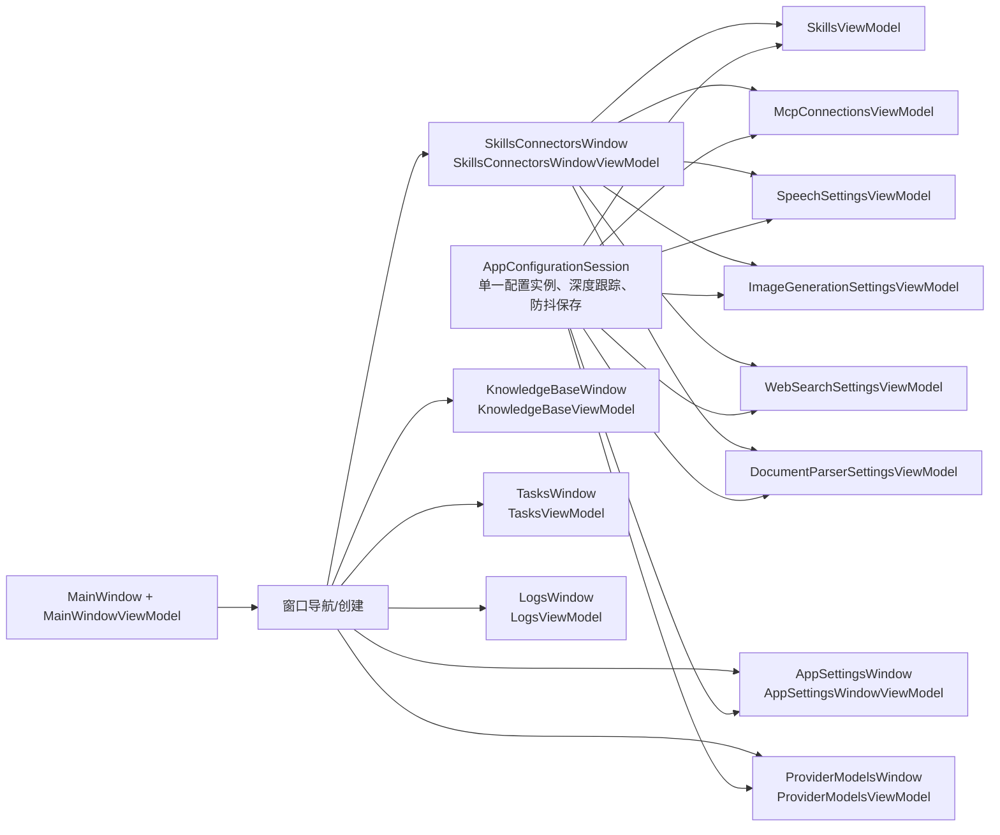

# 旧 Tab 架构清理与视图模块化实施计划

## 1. 文档状态

- 基线分支：`codex/three-pane-multisession-refactor`
- 基线提交：`52d3819`
- 分析日期：2026-07-28
- 当前构建基线：`dotnet build Athena.UI.sln --no-restore` 通过，0 个警告、0 个错误
- 当前测试基线：`Athena.Archive.Tests` 与 `Athena.UI.HeadlessTests` 全部通过
- 本文性质：实施计划与逐阶段实施记录

### 实施进度（2026-07-28）

- [x] 阶段 0：已建立当前窗口组合、配置保存、外部配置替换、文档解析规则、Web Search/语音诊断的特征测试。
- [x] 阶段 1：已提取 `AppConfigurationSession` 和具名配置应用器；生产页面共享同一配置实例和自动保存所有者。
- [x] 阶段 2：已完成 Skills/Connectors 独立窗口 VM、六页面 View/VM、单一内容宿主、共享 Provider Card 和本地化。
- [x] 阶段 3：已迁移旧 Config/Extensions 能力并删除孤儿 View/VM。
- [x] 阶段 4：已删除旧 History 投影和 Tab 导航，归档状态、搜索与删除统一由会话树持有。
- [x] 阶段 5：已完成仍在使用的 View/VM、功能窗口和 App Settings 窗口所有权重命名。
- [x] 阶段 6：已完成动态会话、功能窗口、诊断任务和应用级服务的生命周期清理及重复释放测试。
- [x] 阶段 7：已完成样式/注释/文档/截图清理，并将静态分析与两组测试纳入 CI。

阶段 0 延期项已在阶段 6 关闭：

- Main Conversation 释放测试、Provider Models 关闭后解除订阅及进行中刷新取消均已补齐。

## 2. 结论

当前 UI 已经从大型 `TabControl` 改造成三栏主窗口和若干独立窗口，但业务代码仍保留原 Tab 架构的状态所有权、导航索引、类型命名和页面组合方式。

这不是单纯的命名问题。旧架构目前造成了以下实际后果：

1. 不可见的 `ConfigTabViewModel` 仍承担全局配置属主职责。
2. `AppSettingsViewModel`、`ExtensionsConfigurationViewModel` 和 `ConfigTabViewModel` 同时监听并保存同一个 `AppConfig`，一次属性变化可能产生多次保存和多次 `ConfigChanged` 广播。
3. `SkillsConnectorsWindow` 以整个 `MainWindowViewModel` 为 `DataContext`，页面导航状态泄漏到主窗口。
4. Skills/MCP 以独立 View 嵌入，语音、图像、搜索、文档解析则直接铺在窗口 XAML 中。
5. `ConfigTabView`、`ExtensionsTabView`、`HistoryTabView` 已经没有运行时入口，但相关 VM、事件、命令和注释仍在运行路径中。
6. 旧页面中部分能力没有迁移到新窗口，例如语音输出测试、Web Search 测试、文档解析模式、浏览器诊断、知识库维护和审批白名单管理。
7. 多个长生命周期事件使用匿名订阅，动态创建的对话 VM 和临时供应商窗口 VM 无法完整解除订阅，存在对象被单例或静态事件长期持有的风险。

因此实施策略必须是：

> 先建立清晰的配置状态和页面生命周期 seam，再拆分窗口内容，随后删除孤儿模块，最后统一命名、文档和样式。

不能先全局机械替换 `Tab`，也不能直接删除旧 ViewModel。

## 3. 范围与非目标

### 3.1 本次范围

- 清理主 `TabControl` 消失后遗留的导航状态和事件。
- 重构 `SkillsConnectorsWindow` 为窗口壳 + 六个独立内容 View + 六个页面 VM。
- 统一应用配置的内存实例、深度变更监听、保存和外部刷新。
- 删除确认无入口的旧 View，并迁移或删除对应 VM 职责。
- 将仍在使用的 `*TabView` / `*TabViewModel` 改为符合当前 UI 语义的名称。
- 清理过时注释、空 region、无效样式、旧截图名称和架构文档。
- 补充针对页面组合、配置保存和生命周期的测试。

### 3.2 暂不在本次直接拆解

- `MainConversationViewModel`（当前 `ChatTabViewModel`）内部 3000 余行对话业务的全面模块化。
- `MainWindowViewModel` 中对话树、工作区、日志摘要等全部职责的彻底拆分。
- Workspace 文件编辑器中的 `WorkspaceEditorTabViewModel`。

`WorkspaceEditorTabViewModel` 表示用户真实可见的多文件编辑 Tab，仍符合当前交互语义，不属于旧主 `TabControl` 遗留。

主对话和主窗口的体积问题应记录为后续架构工作；本次只处理与旧 Tab 迁移直接相关的命名、事件和状态所有权。

## 4. 已确认的问题清单

### 4.1 已无运行时入口的 View

以下 View 只有定义，没有任何窗口或其他 View 引用：

| 文件 | 当前状态 | 计划 |
|---|---|---|
| `Views/ConfigTabView.axaml` 及 code-behind | 无运行时入口 | 完成能力迁移后删除 |
| `Views/ExtensionsTabView.axaml` 及 code-behind | 无运行时入口 | 完成能力迁移后删除 |
| `Views/HistoryTabView.axaml` 及 code-behind | 无运行时入口 | 确认会话树覆盖历史能力后删除 |

这些文件仍会参与 Avalonia XAML 编译，因此“构建通过”不能证明它们仍被用户界面使用。

### 4.2 确认无效的旧导航状态

`MainWindowViewModel.SelectedTabIndex` 已无 XAML 绑定，但仍被以下逻辑读写：

- 主动任务触发后写入 `0`
- 加载历史会话后写入 `0`
- `SwitchToTasksTabRequested` 写入 `5`
- `OnSelectedTabIndexChanged` 仍按 `6`、`8` 刷新 History/Logs

由此衍生的以下成员均属于旧主 Tab 导航遗留：

- `SelectedTabIndex`
- `OnSelectedTabIndexChanged`
- `ChatTabViewModel.SwitchToTasksTabRequested`
- `ChatTabViewModel.SwitchToTasksTabCommand`
- `MainWindowViewModel` 中对应订阅

当前任务窗口已有明确的 `OpenScheduledMessagesCommand`，旧事件不应继续存在。

`SelectedConnectorSection` 和 `IsExtensionConnectorSection` 只服务于 `SkillsConnectorsWindow`，也不应属于 `MainWindowViewModel`。

### 4.3 隐藏的配置属主

`ConfigTabViewModel` 的 View 已经消失，但 VM 仍被手工构造并承担以下实现：

- 加载并替换 `AppConfig`
- 监听根属性、AI 模型角色、Provider Profile、MCP 嵌套集合
- 500ms 防抖保存
- 应用主题、Chat 配置、Embedding 配置和 Token 上限
- Embedding 身份变化后失效知识库向量缓存
- 处理外部 `ConfigChanged`
- 为 `SkillsTabViewModel`、`McpTabViewModel`、`ExtensionsTabViewModel` 提供共享配置实例

这是一个有价值但名称错误、接口过大的模块。不能直接删除；应把非 UI 实现迁移到新的配置会话模块。

### 4.4 多个配置保存所有者

生产启动时，下列实例会同时存在：

- `ConfigTabViewModel`：根配置 + AI 模型 + MCP 深度监听，防抖保存。
- `AppSettingsViewModel`：监听根 `AppConfig.PropertyChanged`，立即保存。
- `ExtensionsConfigurationViewModel`：监听根配置和 Extension Provider Settings，立即保存。
- `ProviderModelsViewModel`：窗口每打开一次创建一个 transient VM，监听 Provider 和 Role 并立即保存。

因为 `ConfigService` 返回缓存中的同一个 `AppConfig` 实例，根属性变化可能同时触发多个保存者。每次保存又广播 `ConfigChanged`，会驱动 MCP 生命周期、Chat 配置和并发调度等订阅者。

目标必须是一个配置会话模块负责：

- 当前内存实例
- 嵌套对象跟踪
- 防抖
- 规范化
- 落盘
- 外部替换

页面 VM 只表达用户意图，不各自重新实现自动保存。

### 4.5 `SkillsConnectorsWindow` 的组合不一致

当前窗口：

- 以 `MainWindowViewModel` 为 `DataContext`
- 通过 `SelectedConnectorSection` 整数导航
- 同时实例化六块内容并用 `IsVisible + ConverterParameter=0..5` 切换
- Skills/MCP 使用独立 View
- 后四页直接写在窗口 XAML
- 后四页共同使用 `ExtensionsConfigurationViewModel`
- 子项模板通过 `$parent[...]` 强转祖先 `DataContext` 获取宽高比和搜索模式

这使窗口壳必须理解每个页面的内部字段，页面也必须理解祖先的具体类型，缺少 locality。

### 4.6 旧页面能力尚未完成迁移

删除旧 View 前必须逐项决定这些能力的去向：

| 旧能力 | 当前新 UI 状态 | 推荐去向 |
|---|---|---|
| 语音输出测试、播放/停止测试音频 | 未迁移 | `SpeechSettingsViewModel` |
| Web Search 连接测试 | 未迁移 | `WebSearchSettingsViewModel` |
| 文档解析模式 `AgentLightweight/Precision` | 未迁移 | `DocumentParserSettingsViewModel` |
| Precision 模式 Token 条件启用 | 未迁移 | `DocumentParserSettingsViewModel` |
| 浏览器运行时检测、安装、Agent 测试 | 无可见入口 | App Settings 的诊断模块 |
| 知识库维护、向量索引重建 | 无可见入口 | `KnowledgeBaseViewModel` |
| 自动审批永久放行列表管理 | 无可见入口 | App Settings 的工具审批模块 |
| Terminal allowlist 管理 | 无可见入口 | App Settings 的工具审批模块 |
| 手动压缩/撤销压缩 | 无可见入口；对话 VM 仍保留部分命令 | 主对话调试/上下文入口，或明确删除 UI 命令 |
| Provider Profile 刷新、测试、模型分工 | 已迁移 | `ProviderModelsViewModel`，去除旧副本 |

每个能力只能有一个最终所有者。迁移完成前不删除原实现。

### 4.7 历史页面和当前会话树重复

`HistoryTabView` 不可见，但 `HistoryTabViewModel` 仍：

- 加载完整历史列表
- 监听 archive staged/completed/failed
- 发出 Load/Delete 事件
- 驱动 `MainWindowViewModel` 刷新或切换旧 Tab

当前主窗口已经直接加载 Conversation Archive Store，并在工作区会话树中实现选择、删除、分支和导出。旧 History VM 因而形成第二套不可见投影。

应通过特征测试确认以下能力均由会话树覆盖：

- 未完成归档的状态显示
- 外部归档完成后的列表刷新
- 删除当前会话和非当前会话
- 工作区分组
- 搜索和时间筛选是否仍是产品需求

如果搜索和时间筛选不再是产品需求，则删除整个 History View/VM 和桥接事件；如果仍需要，应作为会话树的筛选模块实现，而不是恢复旧 Tab。

### 4.8 生命周期和事件订阅风险

以下问题与旧 Tab 架构的“VM 永久存活”假设有关：

1. 每个 `ChatTabViewModel` 都匿名订阅静态 `App.ThemeChanged`、单例 `IConfigService.ConfigChanged` 和单例 Localization 事件。
2. `ConversationSessionItemViewModel.Dispose()` 只解除自身对 Chat 的监听，不会释放 Chat 的全局订阅。
3. 多会话创建、删除和切换后，旧 Chat VM 可能继续被静态或单例事件持有。
4. transient `ProviderModelsViewModel` 订阅长期存活的 Provider/Role `PropertyChanged`，窗口关闭时没有解除。
5. Skills/MCP 通过匿名事件订阅隐藏的 `ConfigTabViewModel`，无法独立解除或测试生命周期。

重构后的动态页面 VM 和对话 VM必须采用具名 handler，并实现 `IDisposable` 或明确的 `Activate/Deactivate` 生命周期。

### 4.9 命名、注释、样式和文档遗留

- 多个仍使用的页面继续命名为 `*TabView` / `*TabViewModel`。
- `MainWindowViewModel` 仍保留 `#region Tab ViewModels`、`Tab Navigation Properties` 和空的 `Global Commands` region。
- 注释仍写着“来自 ConfigTabView”“切换到 CHAT”“配置属主为 ConfigTabViewModel”。
- `App.axaml` 仍有全局 `TabItem` 字体样式，以及两套 TabItem 选中画刷覆盖。
- README、用户指南和截图文件仍使用 `ConfigTabView.png`、`ExtensionsTabView.png` 等旧页面名称；其中部分截图对应已不可见 UI。
- `AGENTS.md`、`CLAUDE.md` 的目录说明仍把 History/Config 描述为可见 Tab。

TabItem 主题资源删除前需确认第三方控件模板没有间接引用；全局 `Style Selector="TabItem"` 在应用自身无 TabItem 后可以删除。

## 5. 目标架构



### 5.1 配置会话模块

建议新增具体类 `AppConfigurationSession`，先不要为了测试机械增加接口。只有出现第二个真实 adapter 时才提取 seam。

它应提供较小的 interface：

- `AppConfig Current`
- `Task InitializeAsync()`
- `Task SaveNowAsync()`
- `void Track(...)` 不应暴露给页面；嵌套跟踪属于 implementation
- 配置整体替换通知
- 可选的批量更新/暂停自动保存作用域

Implementation 内部负责：

- 根属性监听
- AI Provider Profile、Role、MCP、Extension Provider Settings 的嵌套监听
- 新增/删除集合项时动态挂接与解除
- 统一 500ms 防抖
- `AppConfigNormalizer`
- `ConfigService.SaveAsync`
- 配置替换时解除旧实例全部订阅

主题、语言、Chat、Embedding、Token 和 MCP 生命周期的应用方式需要统一：

- 页面不直接调用这些模块。
- 配置成功保存后由配置变更订阅者应用。
- Embedding 身份变化和向量缓存失效可拆为具名的配置应用器，避免继续藏在页面 VM。

### 5.2 Skills/Connectors 窗口模块

建议结构：

```text
Views/
  SkillsConnectorsWindow.axaml
  SkillsView.axaml
  McpConnectionsView.axaml
  SpeechSettingsView.axaml
  ImageGenerationSettingsView.axaml
  WebSearchSettingsView.axaml
  DocumentParserSettingsView.axaml
  ExtensionProviderCardView.axaml

ViewModels/
  SkillsConnectorsWindowViewModel.cs
  SkillsViewModel.cs
  McpConnectionsViewModel.cs
  SpeechSettingsViewModel.cs
  ImageGenerationSettingsViewModel.cs
  WebSearchSettingsViewModel.cs
  DocumentParserSettingsViewModel.cs
  ExtensionProviderCardViewModel.cs
```

窗口 VM 拥有：

- `IReadOnlyList<SkillsConnectorSection>` 或等价导航条目
- `SelectedSection`
- 六个页面 VM 的生命周期

窗口 XAML 只拥有：

- 左侧导航
- 右侧 `ContentControl`
- 窗口级布局

项目已有全局 `ViewLocator`，可令 `ContentControl.Content` 直接绑定选中页面 VM，由 `FooViewModel -> FooView` 命名映射创建 View。也可以在窗口资源中写显式 DataTemplate；两者选一种，不混用。

不再允许：

- 页面索引 `0..5`
- 六个同时实例化的 `IsVisible`
- 页面内容直接写在 Window XAML
- `$parent[Window].DataContext`
- 从子项模板强转祖先页面 VM

### 5.3 Extension Provider Card 模块

语音、图像和 Web Search 共享 Provider Card 的选择、展开、凭据和条件字段逻辑。应提取一个可复用的 `ExtensionProviderCardView`。

页面 VM 提供页面级开关、测试命令和卡片集合；卡片 VM 提供：

- Provider 元数据
- 当前设置
- 选择与展开状态
- 字段可见性
- 标签和说明
- 当前字段的候选值，例如宽高比或搜索模式

卡片 View 不应再回溯祖先 DataContext。

## 6. 命名迁移表

最终名称需在实施前结合产品术语确认一次。建议如下：

| 当前名称 | 建议名称 | 说明 |
|---|---|---|
| `ChatTabView` | `MainConversationView` | 使用 CONTEXT.md 中的 Main Conversation |
| `ChatTabViewModel` | `MainConversationViewModel` | 多会话中的每个主对话实例 |
| `SkillsTabView` | `SkillsView` | 不再表达 Tab 容器 |
| `SkillsTabViewModel` | `SkillsViewModel` | 同上 |
| `McpTabView` | `McpConnectionsView` | 表达 MCP 连接管理 |
| `McpTabViewModel` | `McpConnectionsViewModel` | 同上 |
| `KnowledgeBaseTabView` | `KnowledgeBaseView` | 独立窗口内容 |
| `KnowledgeBaseTabViewModel` | `KnowledgeBaseViewModel` | 独立窗口 VM |
| `TasksTabView` | `TasksView` | 对应 `ScheduledTask` / `ITaskScheduler` |
| `TasksTabViewModel` | `TasksViewModel` | 同上 |
| `LogsTabView` | `LogsView` | 独立窗口内容 |
| `LogsTabViewModel` | `LogsViewModel` | 同上 |
| `AboutTabView` | `AboutView` | App Settings 内嵌内容 |
| `AboutTabViewModel` | `AboutViewModel` | 同上 |
| `ScheduledMessagesWindow` | `TasksWindow` | 当前功能包含任务而不只是消息 |
| `ConfigTabViewModel` | 不直接重命名 | 拆成配置会话与各页面 VM |
| `ExtensionsTabViewModel` | 不直接重命名 | 能力迁入四个扩展页面 VM |
| `HistoryTabViewModel` | 原则上删除 | 由会话树承担；保留需求则拆为会话筛选模块 |

重命名应使用 IDE/Roslyn symbol rename 或小批次文件移动，并同步：

- XAML `x:Class`
- `x:DataType`
- code-behind partial class
- ViewLocator 命名约定
- Headless 测试
- 注释、日志类别、文档和截图

## 7. 分阶段实施

### 阶段 0：建立特征测试

目标：先锁定当前有效行为和准备恢复的遗漏能力。

新增测试：

1. [x] `SkillsConnectorsWindow` 可以选择并呈现六个独立页面。
2. [x] 六个独立页面 View 的 `DataContext` 类型正确。
3. [x] 切换页面不创建重复 VM、不重置未保存输入。
4. [x] 修改普通配置、MCP 嵌套项、Provider Setting 时分别只产生一次防抖保存。
5. [x] 外部 `ConfigService.SaveAsync` 替换实例后，所有页面读取同一个新实例。
6. [x] 文档解析模式和 Token 启用规则。
7. [x] Web Search、语音测试命令的成功、失败和取消状态。
8. [ ] 删除/切换会话后旧 Main Conversation VM 可被释放（延期到阶段 6）。
9. [ ] Provider Models 窗口关闭后解除 Provider/Role 订阅（延期到阶段 6）。

同时扩展 Headless 测试：

- [x] 主窗口仍不存在主 TabStrip。
- [x] Skills/Connectors 窗口只存在一个 `ContentControl` 内容宿主。
- [x] 六个导航项与六个页面类型一一对应。

### 阶段 1：提取 `AppConfigurationSession`

1. [x] 从 `ConfigTabViewModel` 迁移配置加载、嵌套监听、防抖和外部替换。
2. [x] 把 `AppSettingsViewModel`、`ExtensionsConfigurationViewModel`、`ProviderModelsViewModel` 改为共享配置会话。
3. [x] 删除各 VM 自己的根 `PropertyChanged -> SaveAsync`。
4. [x] 将配置副作用迁移为具名 `AppConfigurationApplier`。
5. [x] 为嵌套集合新增和移除编写订阅解除测试。
6. [x] 确认一次用户编辑只触发一次持久化广播，并覆盖同实例显式保存取消待执行自动保存。

阶段完成条件：

- [x] 不可见的 `ConfigTabViewModel` 不再是任何页面的配置属主。
- [x] Skills/MCP 不再需要 `Initialize(ConfigTabViewModel)`。
- [x] 所有生产页面读取同一个 `AppConfigurationSession.Current`。

### 阶段 2：重构 `SkillsConnectorsWindow`

1. [x] 新增 `SkillsConnectorsWindowViewModel`。
2. [x] 将 `SelectedConnectorSection` 从 `MainWindowViewModel` 移入窗口 VM，并改为语义化 `SelectedSection`。
3. [x] 将 Skills/MCP View 和 VM 去除 Tab 命名。
4. [x] 新增语音、图像、Web Search、文档解析四组 View/VM。
5. [x] 提取 `ExtensionProviderCardView`；候选值由 Card VM 提供，不再回溯页面祖先。
6. [x] 用单一 `ContentControl` 和 ViewLocator 替代六组 `IsVisible`。
7. [x] 把新窗口和六页面静态文本、Provider Card 标签与说明移入中英文 localization 资源。
8. [x] 恢复语音测试、Web Search 测试、文档解析模式和 Token 条件。

阶段完成条件：

- [x] `SkillsConnectorsWindow.axaml` 不包含具体 Provider 字段。
- [x] 窗口 DataContext 不再是 `MainWindowViewModel`。
- [x] 每个 View 都有准确的 `x:DataType`。
- [x] 新窗口、六页面和 Provider Card 不存在祖先 DataContext 强转。

### 阶段 3：迁移旧 Config/Extensions 能力并删除孤儿模块

按第 4.6 节逐项迁移后：

1. [x] 删除 `ConfigTabView.axaml` 及 code-behind。
2. [x] 删除 `ExtensionsTabView.axaml` 及 code-behind。
3. [x] 删除 `ExtensionsTabViewModel`。
4. [x] 将知识库维护/向量重建迁到 Knowledge Base。
5. [x] 将审批 allowlist 和浏览器诊断迁到 App Settings。
6. [x] 删除 `ConfigTabViewModel` 中已迁移的 UI 属性和命令。
7. [x] 配置会话完全接管后删除剩余 `ConfigTabViewModel`。

阶段完成条件：

- [x] 无任何 `ConfigTabViewModel` 或 `ExtensionsTabViewModel` 引用。
- [x] 删除旧 XAML 后应用构建与 Headless 测试仍通过。
- [x] 旧页面中每个用户能力都有“已迁移”或“明确废弃”的记录。

#### 阶段 3 实施记录（2026-07-28）

能力签收：

| 旧页面能力 | 阶段 3 处理结果 |
|---|---|
| 主题、语言、跳过回退确认 | 已迁移到 App Settings。 |
| 最大上下文、压缩阈值、自动压缩、工作区知识预算 | 已由 App Settings 持有。 |
| 子代理开关、并行数、轮数、超时 | 已由 App Settings 持有。 |
| Provider Profile、模型刷新、模型分工 | 已由 Provider Models 持有；刷新模型同时承担端点/凭据连接验证。 |
| 独立 Embedding 凭据 | 已在 Provider Models 增加兼容连接区；常规路径继续使用 Embedding 模型角色选择的统一 Provider。 |
| 知识库定期维护、立即整理、向量全量重建与状态 | 已迁移到 Knowledge Base View/VM。 |
| 工具永久放行列表、Terminal allowlist 撤销 | 已迁移到 App Settings，并由 `AppConfigurationSession.SaveNowAsync` 统一持久化。 |
| 浏览器运行时检测、Chromium 安装、Browser Agent 连接测试 | 已迁移到 App Settings。 |
| 语音、图像、Web Search、文档解析配置与诊断 | 已由阶段 2 的四个独立页面持有。 |
| 设置页手动压缩/撤销入口 | 明确废弃；自动压缩和主对话内部压缩状态保留，不在设置窗口重复提供会话级操作。 |
| 浏览器高级调参表单 | 明确废弃；浏览器保持默认启用，运行时继续使用 `AppConfigNormalizer` 和既有配置默认值，模型选择归 Provider Models。 |
| 角色 Temperature / MaxOutput 的旧编辑控件 | 明确废弃；运行时由 `OpenAiModelRuntimeFactory` 的角色级内部约束决定，旧 UI 字段不再作为有效运行时调节入口。 |

结构清理：

- 阶段 2 后 `ExtensionsConfigurationViewModel` 已无生产入口；阶段 3 将共享 `ExtensionProviderCardViewModel` / `ExtensionProviderKind` 提取到独立文件后删除该孤儿聚合 VM。
- `MainWindowViewModel` 不再构造或暴露 Config/Extensions 页面 VM，并移除了只为这些 VM 传入的服务依赖。
- Headless 特征测试不再实例化旧页面；新增 App Settings 审批清单/浏览器诊断与 Knowledge Base 维护/向量重建所有权检查。

与计划的偏差及有意延期：

- App Settings 窗口仍按阶段 5 的既定边界使用 `MainWindowViewModel` 作为外层 DataContext；本阶段只把能力迁到现有 `AppSettingsViewModel`，没有提前建立独立窗口 VM。
- Knowledge Base 与 App Settings 新增的长期事件订阅释放仍留给阶段 6 统一处理；本阶段未扩展生命周期改造。
- 未实施阶段 4 的 History/旧导航删除、阶段 5 的语义化重命名或阶段 7 的全局本地化与样式清理。

验证结果：

- [x] `dotnet build Athena.UI.sln --no-restore`：0 warning，0 error。
- [x] `dotnet run --project Athena.Archive.Tests --no-build`：全部通过。
- [x] `dotnet run --project Athena.UI.HeadlessTests --no-build`：全部通过。

### 阶段 4：删除旧 History 投影和 Tab 导航

1. [x] 为会话树补齐必须保留的 archive 状态测试。
2. [x] 确认是否保留搜索/时间过滤产品需求。
3. [x] 删除 `HistoryTabView` 和 code-behind。
4. [x] 删除 `HistoryTabViewModel`，或仅提取仍有需求的纯筛选模块。
5. [x] 删除 `OnHistoryDeleted`、`OnLoadHistoryRequested`、`OnCurrentConversationDeleted` 中只服务旧 History 的桥接。
6. [x] 删除 `SelectedTabIndex`、`OnSelectedTabIndexChanged`。
7. [x] 删除 `SwitchToTasksTabRequested` 和无入口命令。
8. [x] 删除空 region 和旧 Tab 导航注释。

阶段完成条件：

- [x] 会话树直接显示归档暂存、失败和完成后的最新状态。
- [x] 从归档服务外部完成的会话会按工作区插入会话树，既有会话会刷新标题和元数据。
- [x] 会话树统一承担关键词搜索以及当前/非当前会话删除。
- [x] 生产代码不再引用 `HistoryTabViewModel`、`HistoryTabView`、Tab 索引导航或旧 History 事件桥。

#### 阶段 4 实施记录（2026-07-28）

产品取舍：

- 保留会话树现有的关键词搜索；匹配范围包括工作区名称、会话标题和消息内容，足以替代旧 History 页的关键词筛选。
- 明确废弃旧 History 页独有的预设时间范围和自定义日期筛选。三栏架构中没有该功能入口，也没有发现仍在使用的产品流程，因此没有为孤立筛选逻辑保留新模块。
- 会话删除统一从会话树的会话菜单进入；移除聊天标题栏中绕过会话树的重复删除入口。

结构清理：

- `MainWindowViewModel` 直接订阅 `ArchiveStaged`、`ArchiveCompleted` 和 `ArchiveFailed`，将暂存、失败以及完成后的元数据投影到对应会话节点。
- 外部产生的归档完成事件会按 `WorkspaceId` 插入现有工作区组；已有会话按 History/Conversation 标识就地更新。
- `MainConversationViewModel.RestorePersistedConversation` 作为新会话 VM 的纯恢复入口，避免构建会话树时触发旧单会话切换流程。
- 删除 `HistoryTabView`、code-behind、`HistoryTabViewModel`、三个 History/Chat 删除桥接、Tab 索引状态和切换 Tasks 的无入口事件/命令。
- Headless 测试覆盖归档暂存、失败、完成、外部插入、工作区归组、消息关键词搜索，以及当前/非当前会话删除。

与计划的偏差及有意延期：

- 为满足“外部归档完成也必须进入会话树”的阶段完成条件，增加了归档事件投影和 `RestorePersistedConversation` 恢复 seam；它们超出原清单的纯删除动作，但仍严格属于阶段 4 的 History 所有权迁移。
- 删除了聊天标题栏的重复“删除当前会话”入口及其死命令，因为该路径会绕过会话树所有权；删除能力本身仍完整保留在会话菜单。
- 未实施阶段 5 的类型/窗口重命名、阶段 6 的事件退订与对象释放，或阶段 7 的全局样式和文档清理。

验证结果：

- [x] `dotnet build Athena.UI.sln --no-restore`：0 warning，0 error。
- [x] `dotnet run --project Athena.Archive.Tests --no-build`：全部通过。
- [x] `dotnet run --project Athena.UI.HeadlessTests --no-build`：全部通过。

### 阶段 5：重命名仍在使用的 View/VM 和窗口

按第 6 节逐组重命名，每组完成后构建：

1. [x] Skills/MCP。
2. [x] Knowledge Base/Tasks/Logs/About。
3. [x] Main Conversation。
4. [x] 对应的 Headless 测试、注释和日志类别。
5. [x] 将 `SimpleFeatureWindows.cs` 拆成有明确类型的独立窗口文件；不再接受 `object dataContext`。
6. [x] 为 App Settings 建立自己的窗口 VM，停止使用整个 `MainWindowViewModel` 作为 DataContext。

Main Conversation 重命名改动面最大，应最后执行，避免与功能迁移混在同一提交。

阶段完成条件：

- [x] 生产代码不再引用仍存活类型的 `*TabView` / `*TabViewModel` 名称。
- [x] ViewLocator 可继续通过 `FooViewModel -> FooView` 约定定位语义化 View。
- [x] Knowledge Base、Tasks、Logs 窗口构造函数只接受各自的强类型 VM。
- [x] App Settings 使用 `AppSettingsWindowViewModel`，不再以 `MainWindowViewModel` 为 DataContext。
- [x] 重命名后构建、Archive Tests 和 Headless Tests 全部通过。

#### 阶段 5 实施记录（2026-07-28）

命名迁移：

| 旧名称 | 当前名称 |
|---|---|
| `ChatTabView` / `ChatTabViewModel` | `MainConversationView` / `MainConversationViewModel` |
| `KnowledgeBaseTabView` / `KnowledgeBaseTabViewModel` | `KnowledgeBaseView` / `KnowledgeBaseViewModel` |
| `TasksTabView` / `TasksTabViewModel` | `TasksView` / `TasksViewModel` |
| `LogsTabView` / `LogsTabViewModel` | `LogsView` / `LogsViewModel` |
| `AboutTabView` / `AboutTabViewModel` | `AboutView` / `AboutViewModel` |
| `ScheduledMessagesWindow` | `TasksWindow` |

结构清理：

- Skills/MCP 的语义化名称已在阶段 2 完成，本阶段核对后保留，不重复移动。
- `SimpleFeatureWindows.cs` 已拆分为 `KnowledgeBaseWindow.cs`、`TasksWindow.cs` 和 `DetailedLogsWindow.cs`；三个构造函数分别接受 `KnowledgeBaseViewModel`、`TasksViewModel` 和 `LogsViewModel`。
- 新增 `AppSettingsWindowViewModel`，只暴露 `AppSettingsViewModel` 与 `AboutViewModel`；App Settings XAML 的编译绑定和祖先命令绑定均改为该窗口 VM。
- `MainWindowViewModel` 的功能属性、会话创建路径、主窗口绑定、Owl Village、Chat Session Factory、注释和 Serilog 类别已同步到新名称。
- Headless 测试改用新类型，并新增强类型功能窗口与 App Settings 独立 DataContext 的约束。

与计划的偏差及有意延期：

- 阶段 1–4 先按要求提交为 `e16a6a5`，阶段 5 的大范围重命名与旧页面删除没有混入同一提交。
- Skills/MCP 重命名已由阶段 2 提前完成，因此本阶段仅扫描确认。
- Knowledge Base/Tasks/Logs/About 与 Main Conversation 的符号迁移完成后统一进行编译验证，没有在两组之间留下不可编译的中间状态；最终分组和完整方案构建均通过。
- 未更新 AGENTS/README/用户指南、截图文件名或全局样式；这些仍按计划属于阶段 7。未实施阶段 6 的事件退订与释放。

验证结果：

- [x] `dotnet build Athena.UI.sln --no-restore`：0 warning，0 error。
- [x] `dotnet run --project Athena.Archive.Tests --no-build`：全部通过。
- [x] `dotnet run --project Athena.UI.HeadlessTests --no-build`：全部通过。

### 阶段 6：生命周期清理

1. [x] `MainConversationViewModel` 实现明确且幂等的释放流程。
2. [x] 静态主题事件、Localization、ConfigChanged 改为具名订阅并解除。
3. [x] `ConversationSessionItemViewModel.Dispose()` 负责释放其拥有的 Main Conversation VM；`MainWindowViewModel` 统一释放仍在会话树中的 VM。
4. [x] `ProviderModelsViewModel` 在窗口关闭时解除配置订阅，并取消进行中的模型刷新。
5. [x] Skills/MCP/扩展页面由 `SkillsConnectorsWindowViewModel` 随窗口统一释放；App Settings 使用显式 Activate/Deactivate。
6. [x] 取消未完成的防抖、模型刷新、诊断、音频、预览和对话后台 `CancellationTokenSource`。
7. [x] 增加反复打开/关闭窗口及创建/删除会话的生命周期测试。

#### 阶段 6 实施记录（2026-07-28）

生命周期所有权：

- `MainConversationViewModel`、`ConversationSessionItemViewModel` 和 `MainWindowViewModel` 均实现幂等释放；会话删除、主窗口关闭和应用退出形成从容器到会话再到对话 VM 的所有权链。
- Main Conversation 的主题、本地化、配置、消息集合、附件集合、归档和子代理事件全部改为可解除的具名处理器；释放时同时停止计时器并取消响应、预览、截图和音频工作。
- `ProviderModelsWindow`、`AppSettingsWindow`、`SkillsConnectorsWindow` 和 `OnboardingWindow` 在关闭时释放各自 DataContext；Provider Models、Web Search、语音、图像和文档设置页停止接收共享配置替换并取消仍在运行的诊断或刷新。
- `App` 退出时先持久化主窗口状态，再释放主窗口 VM 和 DI 容器；持有 watcher、timer、semaphore、浏览器/向量/归档资源的进程级服务补充了明确释放路径。

回归覆盖：

- Headless 测试连续 10 次创建/删除会话，逐次验证 Config、Archive 和 Localization 的订阅计数回到零，并验证重复 `Dispose()` 安全。
- Headless 测试连续 5 次实际打开/关闭 Skills & Connectors，确认六个页面关闭后不再接收外部配置替换。
- Provider Models 测试确认释放会取消进行中的模型目录刷新，并解除共享配置会话订阅。

与计划的偏差：

- 为满足新增的 `CA1001`/`CA2000` 生命周期门禁，释放范围从窗口和页面 VM 扩展到确实持有 watcher、timer、semaphore、CTS 或其他 disposable 的应用级服务；这是分析器发现的同类所有权问题，没有扩展到新的产品能力或后续架构拆分。
- Skills/MCP 页面已在阶段 2 采用窗口级聚合所有权，因此阶段 6 没有再引入额外 Activate 状态机，而是保留初始化一次、窗口关闭统一 Dispose 的模型。

### 阶段 7：样式、注释、文档和静态分析

1. [x] 删除应用内无实际 TabItem 后的全局 `TabItem` Style。
2. [x] 验证并清理 TabItem 主题画刷覆盖。
3. [x] 清理所有过时 Tab 注释和空 region。
4. [x] 更新 `AGENTS.md`、`CLAUDE.md` 的目录说明。
5. [x] 更新 README 和中英文用户指南。
6. [x] 重新截取当前 UI，使用语义化文件名替换 `*TabView.png`。
7. [x] 增加 `.editorconfig` 和 .NET analyzer 配置，至少启用：
   - 未使用 private 成员
   - 未使用 using
   - 可释放对象和事件生命周期检查
   - async 方法与取消令牌规则
8. [x] 将 analyzer 纳入 CI，避免旧代码再次无声积累。

#### 阶段 7 实施记录（2026-07-28）

- `App.axaml` 已删除全局 `TabItem` Style、字体选择器中的 `TabItem` 以及明暗主题内的 Tab 选中画刷覆盖；空的旧 Tab region 和过时注释一并清理。
- `AGENTS.md`、`CLAUDE.md`、README、README_CN 和中英文用户指南已改用三栏主壳、语义化功能窗口、App Settings、Provider Models、Skills & Connectors 和 Knowledge Base 的当前术语。
- Headless 测试直接生成 `MainShell.png`、`KnowledgeBaseWindow.png`、`AppSettingsWindow.png` 和 `SkillsConnectorsWindow.png`；文档引用已切换，6 张旧 `*TabView.png` 已删除。
- 新增 `.editorconfig`，将 IDE0005、IDE0051、CA1001、CA2000、CA2012、CA2016 提升为构建错误；`Directory.Build.props` 显式启用最新 .NET analyzer 和构建时代码风格检查。
- 新增 `.gitattributes`，让 Git 的空白检查正确识别仓库既有 C# CRLF 行尾，避免把合法的回车误报为尾随空白。
- CI 现在执行 Release 模式的 Build and analyze，并在同一构建产物上运行 Archive Tests 与 Headless UI Tests。

与计划的偏差：

- 截图由 Headless 测试确定性生成，而不是手工截取；这样可以让文档截图与受测窗口组合保持同步。
- CA2000 对窗口/聚合 VM 的明确所有权转移存在数据流误报：生产代码使用窄范围、带理由的 `SuppressMessage`，Headless 组合根使用文件级 CA2000 抑制；规则仍在其他生产和测试代码中保持 error，未全局降级。
- 启用 IDE0005 后机械清理了历史无效 `using`；其中源生成器依赖但编译器误判的 JSON 属性改为完全限定名，未关闭规则。
- 为让构建时代码风格分析稳定运行启用了文档文件生成；既有 XML 注释完整性告警（CS1573/CS1574/CS1591）不属于本阶段的死代码/生命周期范围，保持定向 `NoWarn`，没有降低新增 analyzer 规则。

验证结果：

- [x] `dotnet build Athena.UI.sln --configuration Release --no-restore -p:ContinuousIntegrationBuild=true`：0 warning，0 error。
- [x] `dotnet run --project Athena.Archive.Tests --configuration Release --no-build`：全部通过。
- [x] `dotnet run --project Athena.UI.HeadlessTests --configuration Release --no-build`：全部通过。

## 8. 提交拆分建议

每个提交都应可构建、可回滚：

1. `test: characterize post-tab navigation and settings behavior`
2. `refactor: centralize application configuration session`
3. `refactor: modularize skills and connectors window`
4. `refactor: migrate legacy settings capabilities`
5. `cleanup: remove orphaned config and extensions tabs`
6. `cleanup: remove legacy history projection and tab navigation`
7. `refactor: rename live tab-era views and view models`
8. `fix: release conversation and settings view-model subscriptions`
9. `docs: update post-tab architecture and screenshots`
10. `build: enable dead-code and lifecycle analyzers`

不建议把删除、全局重命名和配置持久化重构放入同一个提交。

## 9. 风险与控制

| 风险 | 影响 | 控制 |
|---|---|---|
| 配置保存时序变化 | 设置丢失或 MCP 重连次数变化 | 保存计数测试、嵌套集合测试、一次编辑一次广播 |
| 删除隐藏 VM 时遗漏副作用 | 主题、Embedding、Token 不刷新 | 先列出副作用并迁入配置应用器 |
| 删除旧页面时丢失能力 | 测试/诊断入口消失 | 使用能力迁移表逐项签收 |
| History 删除后归档状态缺失 | 会话树显示过期 | archive staged/completed/failed 特征测试 |
| 全局重命名破坏 ViewLocator | 运行时显示 `Not Found` | 每组重命名后运行 Headless 渲染 |
| 释放事件订阅时机错误 | 活跃会话不再响应主题/配置 | 激活/释放测试和多会话测试 |
| Provider Card 过度抽象 | 单个 View 条件过多 | 保留页面级 VM；卡片只共享真实重复字段 |

## 10. 最终验收标准

### 架构

- [x] 主窗口中不存在旧主 Tab 导航状态。
- [x] 每个独立窗口都有自己的 VM。
- [x] `SkillsConnectorsWindow` 是纯窗口壳。
- [x] 六个 Skills/Connectors 页面各有独立 View 和 VM。
- [x] 配置只有一个内存实例和一个自动保存所有者。
- [x] 页面 VM 不依赖已不可见的 `ConfigTabViewModel`。
- [x] 动态 VM 的全局事件订阅可以完整解除。

### 代码

- [x] 不存在无入口的 Config/Extensions/History View。
- [x] 不存在旧 `SelectedTabIndex`、魔法页面索引和空 Tab region。
- [x] 除 Workspace 文件编辑器外，不再使用旧主 Tab 语义命名。
- [x] XAML 不通过祖先强转获取页面命令或选项。
- [x] 用户可见文本全部通过 localization 资源。

### 行为

- [x] 原有六个 Skills/Connectors 页面功能可用。
- [x] 语音和 Web Search 测试可用。
- [x] 文档解析模式和 Token 条件正确。
- [x] Provider、MCP、Extension Settings 修改可持久化。
- [x] 一次配置编辑只产生一次预期保存/广播。
- [x] 会话创建、删除、切换和归档行为无回归。

### 验证

- [x] `dotnet build Athena.UI.sln --no-restore`
- [x] `dotnet run --project Athena.Archive.Tests`
- [x] `dotnet run --project Athena.UI.HeadlessTests`
- [x] Skills/Connectors 六页 Headless 渲染检查
- [x] 多次打开/关闭设置窗口的生命周期检查
- [x] 多会话创建/删除后的对象释放检查
- [x] README、用户指南、AGENTS/CLAUDE 与当前结构一致

## 11. 推荐起点

最高优先级不是改文件名，而是阶段 0 和阶段 1：

1. 用特征测试锁定配置、MCP、Extension Provider 和会话归档行为。
2. 提取 `AppConfigurationSession`，终止隐藏 `ConfigTabViewModel` 作为全局状态属主的现状。
3. 在这个稳定 seam 上实施 `SkillsConnectorsWindow` 六页面模块化。

这样可以获得最大的 locality：配置变更、保存、迁移和生命周期问题集中在一个模块内，后续删除旧页面和统一命名就会变成低风险的结构性工作。
