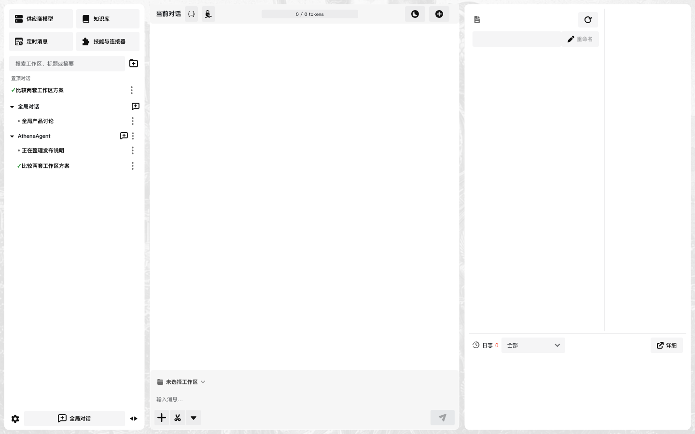
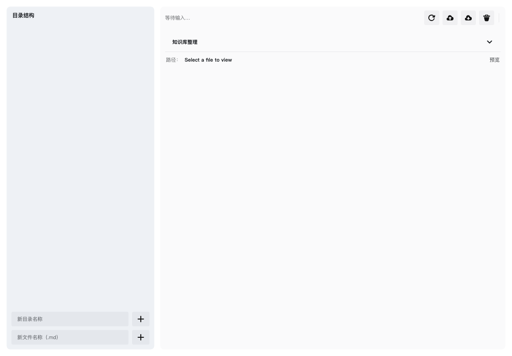
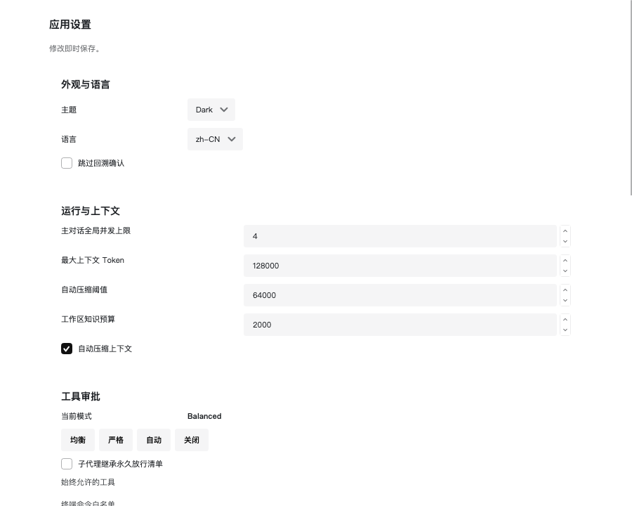
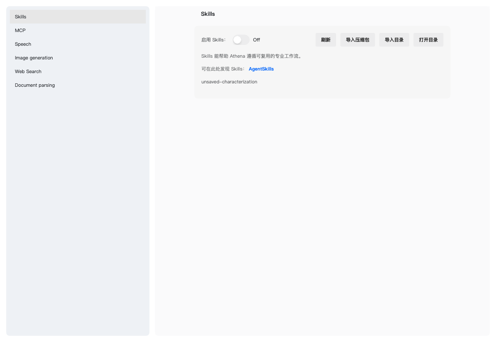

[](README_CN.md) · **English**

---

# Athena Assistant

Athena is a sophisticated, highly autonomous desktop AI assistant built with **.NET 10** and **Avalonia UI**. It serves as an intellectual partner with deep system integration, proactive capabilities, and a modern, polished interface.

## ✨ Key Features

- **🧠 Unified Provider and Model Roles**: One OpenAI SDK-compatible provider owns shared connection details; main chat, titles, compression, automatic approval, embeddings, browser work, and sub-agents select independent models. TTS and image generation keep their own Extension connections.
- **🛠️ Isolated Tool Agent**: The main conversation delegates through one controlled execution agent, which invokes built-in and MCP tools and returns evidence; every real call remains visible in grouped, expandable cards.
- **🦉 Parallel Sub-Agents**: Fans out batches of isolated sub-agents for concurrent work, visualized as an animated "owl village" overview.
- **🌐 Browser Automation**: Runs vision-guided, isolated browser sessions (Playwright + Set-of-Marks) to inspect web pages, click visible controls, fill simple forms, upload local files, and extract page evidence.
- **📚 Local Knowledge Base**: A vector-powered semantic memory stored locally in Markdown files with hybrid retrieval (vectors + BM25/FTS) and background self-maintenance, ensuring privacy and instant retrieval.
- **📄 Document Parsing**: MinerU-backed extraction of outlines and content from attached documents.
- **🎨 Image Generation & Audio**: Inline image generation with cross-turn continuity, plus TTS audio playback.
- **↩️ Conversation Archive, Rewind & Fork**: Persisted, browsable sessions that can be rewound or forked into branch conversations.
- **⏰ Proactive Engagement**: Features an integrated task scheduler for reminders, follow-ups, and automated system checks.
- **🌍 Modern Cross-Platform UI**: Built with Avalonia UI and the Semi Design aesthetic, supporting both light/dark modes and multi-lingual interfaces (English & Chinese).
- **🛡️ Security-First Design**: Implements strict data sandboxing, file system protection, and secure API management.

## 🖼️ Interface Preview

| Three-pane workspace | Knowledge Base |
| --- | --- |
|  |  |
| App Settings | Skills & Connectors |
|  |  |

## 🚀 Getting Started

### Prerequisites

- [.NET 10 SDK](https://dotnet.microsoft.com/download/dotnet/10.0)

### Installation & Running

1. **Clone the repository**:
   ```bash
   git clone https://github.com/your-username/AthenaAgent.git
   cd AthenaAgent
   ```

2. **Restore dependencies**:
   ```bash
   dotnet restore
   ```

3. **Run the application**:
   ```bash
   dotnet run
   ```

## 🏗️ Project Structure

- `Services/`: Core business logic, including AI integration, file system management, and task scheduling.
- `ViewModels/`: MVVM ViewModels for application state and UI logic.
- `Views/`: Avalonia XAML definitions for the user interface.
- `Models/`: Data structures, configuration schemas, and prompt templates.
- `Assets/`: Icons, localized strings, and static knowledge base files.

## 🛠️ Tech Stack

- **Framework**: Avalonia UI 12.0
- **Runtime**: .NET 10
- **UI Themes**: Semi.Avalonia, Irihi.Ursa.Themes.Semi
- **AI SDK**: OpenAI SDK 2.x (Chat, Embeddings, Image Generation, Audio/TTS, Tool Calling; shared retry and timeout policy)
- **Markdown**: LiveMarkdown.Avalonia (streaming output with inline images)
- **Browser Automation**: Microsoft.Playwright
- **Audio**: LibVLCSharp
- **Database**: SQLite (for vector storage)
- **Logging**: Serilog (File + Console sinks)

## 📄 License

This project is licensed under the MIT License - see the [LICENSE](LICENSE) file for details.
